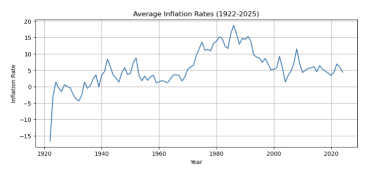

# CPI Indices and Inflation Rate Time Series Analysis and Forecasting 

## Aim

The aim of this project is to analyse South African CPI and inflation rate data using time series methods and to generate forecasts of future values. The models applied include SARIMAX and Prophet, and their performance is compared to determine which provides more accurate forecasts.

## Description of Data

The data was obtained from [StatsSA](http://www.statssa.gov.za/) and is publicly available in PDF format. It consists of:  
- Monthly CPI indices from 1980 to 2025  
- Inflation rates from 1911 to 2025 for each month

Data preprocessing steps included:  
- Converting the PDF to CSV format  
- Concatenating split tables for inflation rates  
- Correcting indexing and formatting of headings  
- Handling missing values  
- Converting values to float (replacing decimal commas with decimal points)  
- Transforming data from wide to long format for time series analysis

## Tools
- Python 
- Jupyter Notebook

## Insights

### CPI Analysis:
Both Prophet and SARIMAX provide reliable CPI forecasts, but SARIMAX is more accurate and closely matches the actual values, making it the preferred model for short and medium term predictions.

### Inflation Rate Analysis:
While the model used in Prophet captures long term historical patterns in the inflation rate, its predictive performance on recent data is less accurate, as actual values deviate from the forecast. Further analysis of the series along with appropriate transformations or alternative modelling approaches can be undertaken to improve the accuracy and robustness of the results.

## Project Report
[Download the project report](CPI_Inflation_Project.pdf)

## Acknowledgements
- Data provided by [StatsSA](http://www.statssa.gov.za/)  
